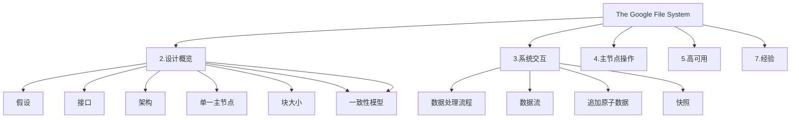

# GFS

Google File System（GFS）是大数据平台hadoop的基础，该文件系统是由Sanjay Ghemawat等在2003年的论文上第一次提出的。本文主要介绍一下该论文的内容。

### 1.论文架构

```mermaid
graph TD
A[The Google File System]
A --> C[2.设计概览]
A --> D[3.系统交互]
A --> E[4.主节点操作]
A --> F[5.高可用]
A --> G[7.经验]
C --> C1[假设]
C --> C2[接口]
C --> C3[架构]
C --> C4[单一主节点]
C --> C5[块大小]
C --> C6[元数据]
C --> C6[一致性模型]
D --> D1[数据处理流程]
D --> D2[数据流]
D --> D3[追加原子数据]
D --> D4[快照]
```

