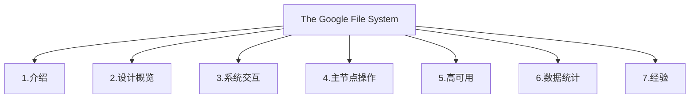

# GFS

Google File System（GFS）是大数据平台hadoop的基础，该文件系统是由Sanjay Ghemawat等在2003年的论文上第一次提出的。本文主要介绍一下该论文的内容。

### 1.论文架构

论文一共分为7个部分，分别是介绍，设计概览，系统交互，主节点操作，高可用，数据统计以及经验介绍，其中的2-5主要介绍了GFS的设计思路，是我们需要精度的部分，本文主要分析一下这部分内容，其它的有兴趣的读者可以略读一下。

### 2.设计概览

2.1 假设

在设计GFS的时候是由一定的假设或者前提的，这部分内容可以作为使用该工具的参考，看一下GFS适用于哪些情况，是技术选型的一个参考。

假设一：该系统建立在很多廉价的、易损坏的基础硬件之上，也就是普通的PC。该系统要能够一直监控系统中的组件，能够监控、侦查、容错、恢复损坏的节点。

假设二：该系统能够存储大量文件，比如上百万个文件，每个文件100M大小。要能够支持上G大小的文件，也能够支持几k的小文件，这些都要能够有效的支持，而不需要使用者做额外的优化。

假设三：该系统的工作量负载主要是提供大的流文件读取和小的随机读取。大的流文件读取是为了满足大文件的顺序读取。而随机读取是根据一定的偏移量读取指定的内容。

假设四：该系统的工作量负载还包括大量的、顺序的追加文件，一旦数据被写入后，文件就很少发生修改。该系统要支持对文件任意位置内容的修改，但是不用考虑效率问题。这个假设决定了GFS不能应用于频繁删除和新建数据的情况。

假设五：该系统要能够高效的支持多个客户端并发的往一个文件中追加内容。

假设六：持续稳定的高带宽，比低延时要重要。因为前端的应用会做相应的处理，很少会需要进行低延时的处理。所以GFS不适合要求低延时的场景。

2.2 接口

GFS提供的接口类似于文件系统，GFS提供文件的  *create*, *delete*,*open*, *close*, *read*和 *write* 接口，另外还提供  *snapshot(快照)*和  *record append*接口.

2.3 架构